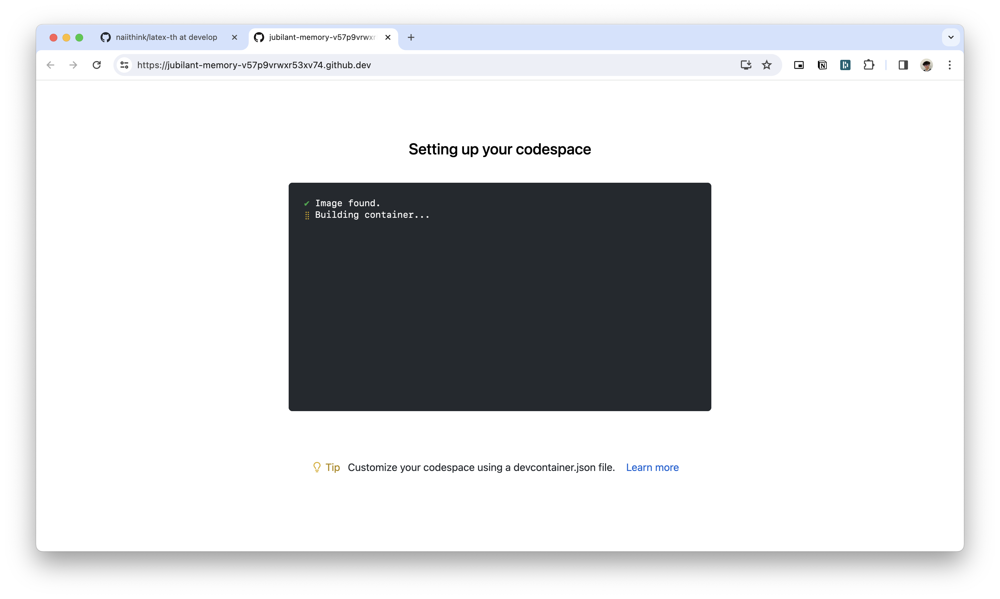
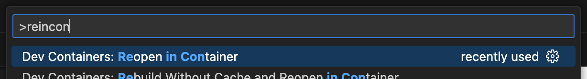

# $\rm{\LaTeX}$-th

> VS Code Dev Containers + Alpine image + $\rm{\TeX}$ Live (APK package)

$\rm{\LaTeX}$ Repository Template


ทดสอบการใช้งานแล้วกับ $\rm{\LaTeX{}2e}$

## ที่มาของ Project

Project นี้ถูกสร้างขึ้นเพื่อเป็นเครื่องมืออำนวยความสะดวกให้กับสมาชิกของห้องแลบวิจัย CNC
ในการใช้ $\rm{\LaTeX}$ สร้างสรรค์ผลงานทางวิชาการ

**Communications, Analytics, and Cloud Research Laboratory (CNC Lab)**  
ภาควิชาวิทยาการคอมพิวเตอร์ คณะวิทยาศาสตร์ มหาวิทยาลัยเกษตรศาสตร์ ประเทศไทย

## เริ่มต้น

### GitHub Codespaces[^1]

ใช้ template นี้บน cloud ด้วย GitHub Codespaces

> [!CAUTION]  
> Codespace อาจถูกลบโดยอัตโนมัติเมื่อไม่ได้ถูกใช้งานเป็นระยะเวลาหนึ่ง[^2]


1. สร้าง repository ใหม่บน GitHub โดยใช้ template นี้
1. ที่ repository ที่สร้างใหม่ กดปุ่ม **Code** &rarr; **Codespaces** &rarr; **Create codespace on main**

   

1. รอจน Codespace ถูกตั้งค่าจนเสร็จแล้วเริ่มใช้งานได้เลย

   

### VS Code Dev Containers[^3]

ใช้ template นี้บนคอมพิวเตอร์ของคุณเองด้วย VS Code Dev Containers

#### สิ่งที่คุณจะต้องติดตั้ง

- [Docker](https://www.docker.com/)
- [VS Code](https://code.visualstudio.com/)

#### ขั้นตอนการตั้งค่า

1.  สร้าง repository ใหม่บน GitHub โดยใช้ template นี้
1.  เปิด repository ที่สร้างใหม่ใน VS Code
1.  ติดตั้ง VS Code extension `ms-vscode-remote.remote-containers`

    - เลือกที่ **Extensions** &rarr; ค้นหา **`ms-vscode-remote.remote-containers`** &rarr; ติดตั้ง extension
    - (_อีกวิธีหนึ่ง_) เรียกคำสั่ง **View: Show Extensions** ผ่าน VS Code Command Palette หรือด้วยคีย์ลัด (<kbd>Shift</kbd>+<kbd>Command</kbd>+<kbd>X</kbd> (Mac) / <kbd>Ctrl</kbd>+<kbd>Shift</kbd>+<kbd>X</kbd> (Windows/Linux))

    > หากเปิดใช้งานคำสั่ง `code` ของ VS Code ไว้ สามารถใช้คำสั่งด้านล่างนี้
    >
    >     $ code --install-extension ms-vscode-remote.remote-containers

1.  เรียก VS Code Command Palette (<kbd>Shift</kbd>+<kbd>Command</kbd>+<kbd>P</kbd> (Mac) / <kbd>Ctrl</kbd>+<kbd>Shift</kbd>+<kbd>P</kbd> (Windows/Linux))
    แล้วเลือกคำสั่ง **Remote-Containers: Reopen in Container**

    

1.  รอจน container ถูกตั้งค่าจนเสร็จแล้วเริ่มใช้งานได้เลย

## การทดสอบการใช้งาน

1.  เปิดไฟล์ทดสอบ `_test/hello.tex`

    > หากเปิดใช้งานคำสั่ง `code` ของ VS Code ไว้ สามารถใช้คำสั่งด้านล่างนี้
    >
    >     $ code _test/hello.tex

1.  Compile ไฟล์ทดสอบด้วยการกดปุ่ม run หรือเรียกคำสั่ง **LaTeX Workshop: Build LaTeX Project** ผ่าน VS Code Command Palette หรือด้วยคีย์ลัด (<kbd>Option</kbd>+<kbd>Command</kbd>+<kbd>B</kbd> (Mac) / <kbd>Ctrl</kbd>+<kbd>Alt</kbd>+<kbd>B</kbd> (Windows/Linux))
1.  หาก compile เสร็จสมบูรณ์ ควรจะได้ `_test/hello.pdf` ที่ไม่ว่างเปล่า (not blank)

## เมื่อต้องการหยุดใช้งาน

### GitHub Codespaces

เรียก VS Code Command Palette (<kbd>Shift</kbd>+<kbd>Command</kbd>+<kbd>P</kbd> (Mac) / <kbd>Ctrl</kbd>+<kbd>Shift</kbd>+<kbd>P</kbd> (Windows/Linux))
แล้วเลือกคำสั่ง **Codespaces: Stop Codespace**

### VS Code Dev Containers

- หากต้องการเปลี่ยนไปใช้งานนอก Dev Container ให้เรียกคำสั่ง **Dev Containers: Reopen Folder Locally** ผ่าน VS Code Command Palette

  

- หากต้องการหยุดใช้งาน (ปิด project) ให้เรียกคำสั่ง **Remote: Close Remote Connection** ผ่าน VS Code Command Palette

## การ Compile และการตั้งค่า Build Steps

> [!NOTE]
>
> - หากใช้งาน LaTeX Workshop สามารถตรวจสอบบันทึก (logs) การ compile ได้ที่ **Output** pane ของ VS Code หรือใช้คีย์ลัด (<kbd>Shift</kbd>+<kbd>Command</kbd>+<kbd>U</kbd> (Mac) / <kbd>Ctrl</kbd>+<kbd>Alt</kbd>+<kbd>U</kbd> (Windows/Linux)) แล้วเลือก **LaTeX Compiler**
> -

### การ Compile

โดยทั่วไป สามารถ compile/build $\rm{\LaTeX}$ projects ได้ด้วยวิธีต่อไปนี้

- Command Line Interface (CLI)
- LaTeX Workshop Magic Comments ดูข้อมูลเพิ่มเติมได้ที่ _Compiling Features_ ด้านล่าง
- LaTeX Workshop Recipe system (build steps)

### การตั้งค่า Build Steps

Template นี้อาศัย VS Code extension ที่ชื่อว่า **LaTeX Workshop** ในการจัดการขั้นตอนการ build

- (จากประสบการณ์การใช้งานของผู้เขียน) Recipe system มีลำดับความสำคัญเหนือกว่า Magic Comments
- การสั่ง build สามารถทำได้หลายวิธี อย่างเช่น ด้วยการกดปุ่ม run หรือเรียกคำสั่ง **LaTeX Workshop: Build LaTeX Project** ผ่าน VS Code Command Palette หรือด้วยคีย์ลัด (<kbd>Shift</kbd>+<kbd>Command</kbd>+<kbd>B</kbd> (Mac) / <kbd>Ctrl</kbd>+<kbd>Alt</kbd>+<kbd>B</kbd> (Windows/Linux)) เป็นต้น
- สามารถตั้งค่าคำสั่งที่ต้องการให้ทำเมื่อ build ได้ที่ [`.vscode/settings.json`](.vscode/settings.json)

  - คำสั่งอย่างเช่น `pdflatex`, `xelatex`, หรือ `bibtex` จะถูกกำหนดที่ `"latex-workshop.latex.tools": []` โดยแต่ละคำสั่งจะถูกเรียกว่า Tool
  - ขั้นตอนการ build จะถูกกำหนดที่ `"latex-workshop.latex.recipes": []` โดยขั้นตอนแต่ละแบบจะถูกเรียกว่า Recipe
  - หนึ่ง Recipe คือหนึ่ง sequence ที่จะต้องประกอบด้วย $\ge$ หนึ่ง Tool ถึงจะทำงานได้
  - ที่ `"latex-workshop.latex.recipes": []`, Recipe ที่อยู่ลำดับแรกสุดจะถูกเรียกเมื่อกดปุ่ม run หรือเรียกคำสั่ง **LaTeX Workshop: Build LaTeX Project** ผ่าน VS Code Command Palette หรือด้วยคีย์ลัด (<kbd>Shift</kbd>+<kbd>Command</kbd>+<kbd>B</kbd> (Mac) / <kbd>Ctrl</kbd>+<kbd>Alt</kbd>+<kbd>B</kbd> (Windows/Linux))
  - Tools และ Recipes ที่เตรียมไว้ให้เพิ่มเติมจากค่าเริ่มต้นมีดังนี้

    ```json
    {
      ...

      "latex-workshop.latex.tools": [
        {
          // ใช้สำหรับเรียกคำสั่ง xelatex ด้วย option -shell-escape
          "name": "xelatexsh",
          "command": "xelatex",
          "args": ["-shell-escape", "-pdf", "%DOC%"]
        }
      ],
      "latex-workshop.latex.recipes": [
        {
          "name": "xelatex ➞ bibtex ➞ xelatex × 2",
          "tools": ["xelatex", "bibtex", "xelatex", "xelatex"]
        },
        {
          "name": "xelatexsh × 3",
          "tools": ["xelatexsh", "xelatexsh", "xelatexsh"]
        },
        {
          "name": "xelatexsh ➞ bibtex ➞ xelatexsh × 2",
          "tools": ["xelatexsh", "bibtex", "xelatexsh", "xelatexsh"]
        }
      ],

      ...
    }
    ```

- สามารถลบไฟล์ auxiliary ต่าง ๆ ที่ถูกสร้างขึ้นมาระหว่างที่ build ได้โดยเรียกคำสั่ง **LaTeX Workshop: Clean up auxiliary files** ผ่าน VS Code Command Palette หรือด้วยคีย์ลัด (<kbd>Option</kbd>+<kbd>Command</kbd>+<kbd>C</kbd> (Mac) / <kbd>Ctrl</kbd>+<kbd>Alt</kbd>+<kbd>C</kbd> (Windows/Linux))
- สามารถยกเลิกการ build ได้โดยเรียกคำสั่ง **LaTeX Workshop: Kill LaTeX compiler process** ผ่าน VS Code Command Palette

## คำสั่งและคีย์ลัดพื้นฐาน[^4]

| การกระทำ                                              | VS Code Command Palette                     | Shortcuts (Mac)                                                        | Shortcuts (Windows/Linux)                                           |
| :---------------------------------------------------- | :------------------------------------------ | :--------------------------------------------------------------------- | :------------------------------------------------------------------ |
| VS Code Command Palette                               | $\emptyset$                                 | <kbd>Shift</kbd>+<kbd>Command</kbd>+<kbd>P</kbd>                       | <kbd>Ctrl</kbd>+<kbd>Shift</kbd>+<kbd>P</kbd>                       |
| เปิด `.vscode/settings.json` (Workspace settings)     | Preferences: Open Workspace Settings (JSON) | $\emptyset$                                                            | $\emptyset$                                                         |
| VS Code extensions                                    | View: Show Extensions                       | <kbd>Shift</kbd>+<kbd>Command</kbd>+<kbd>X</kbd>                       | <kbd>Ctrl</kbd>+<kbd>Shift</kbd>+<kbd>X</kbd>                       |
| Build $\rm{\LaTeX}$ project                           | LaTeX Workshop: Build LaTeX project         | <kbd>Option</kbd>+<kbd>Command</kbd>+<kbd>B</kbd>                      | <kbd>Ctrl</kbd>+<kbd>Alt</kbd>+<kbd>B</kbd>                         |
| ยกเลิกการ build (Kill compiler process)               | LaTeX Workshop: Kill LaTeX compiler process | $\emptyset$                                                            | $\emptyset$                                                         |
| ลบไฟล์ auxiliary ต่าง ๆ                               | LaTeX Workshop: Clean up auxiliary files    | <kbd>Option</kbd>+<kbd>Command</kbd>+<kbd>C</kbd>                      | <kbd>Ctrl</kbd>+<kbd>Alt</kbd>+<kbd>C</kbd>                         |
| ดูบันทึกการ compile (Compiler logs)                   | LaTeX Workshop: View LaTeX compiler logs    | <kbd>Shift</kbd>+<kbd>Command</kbd>+<kbd>U</kbd> &rarr; LaTeX Compiler | <kbd>Ctrl</kbd>+<kbd>Shift</kbd>+<kbd>U</kbd> &rarr; LaTeX Compiler |
| [**Codespaces**] หยุดการทำงานของ Codespace            | Codespaces: Stop Codespace                  | $\emptyset$                                                            | $\emptyset$                                                         |
| [**Dev Containers**] เปิด project ใน container        | Remote-Containers: Reopen in Container      | $\emptyset$                                                            | $\emptyset$                                                         |
| [**Dev Containers**] เปลี่ยนไปใช้งานนอก Dev Container | Dev Containers: Reopen Folder Locally       | $\emptyset$                                                            | $\emptyset$                                                         |
| [**Dev Containers**] ปิด project                      | Remote: Close Remote Connection             | $\emptyset$                                                            | $\emptyset$                                                         |

## ข้อมูลเพิ่มเติม

### LaTeX Workshop (VS Code Extension)

#### Compiling Features[^5]

> [!CAUTION]  
> โดยค่าเริ่มต้น Magic Comments จะถูกปิดใช้งานด้วยเหตุผลด้านความปลอดภัย[^6]

คุณสามารถเลือก $\rm{\LaTeX}$ compiler ได้ผ่าน

- Recipe system
- Magic Comments โดยเพิ่ม `% !TEX program = <program>` ใส่ในไฟล์ `.tex`  
  โดยค่าเริ่มต้น คุณจะไม่สามารถใช้ feature นี้ได้ ด้วยเหตุผลด้านความปลอดภัย
  แต่ถ้าคุณยังคงต้องการใช้ Magic Comments ให้ตั้งค่าดังต่อไปนี้

  ในไฟล์ [`.vscode/settings.json`](.vscode/settings.json)

  ```json
  {
    ...

    "latex-workshop.latex.build.forceRecipeUsage": false,

    ...
  }
  ```

[^1]: https://github.com/features/codespaces
[^2]: https://docs.github.com/en/codespaces/developing-in-a-codespace/deleting-a-codespace
[^3]:
    https://containers.dev/,  
     https://code.visualstudio.com/docs/devcontainers/containers

[^4]:
    https://code.visualstudio.com/docs/getstarted/keybindings,  
    https://github.com/James-Yu/LaTeX-Workshop/wiki/Snippets

[^5]: https://github.com/James-Yu/LaTeX-Workshop/wiki/Compile
[^6]: https://github.com/James-Yu/LaTeX-Workshop/issues/3027
