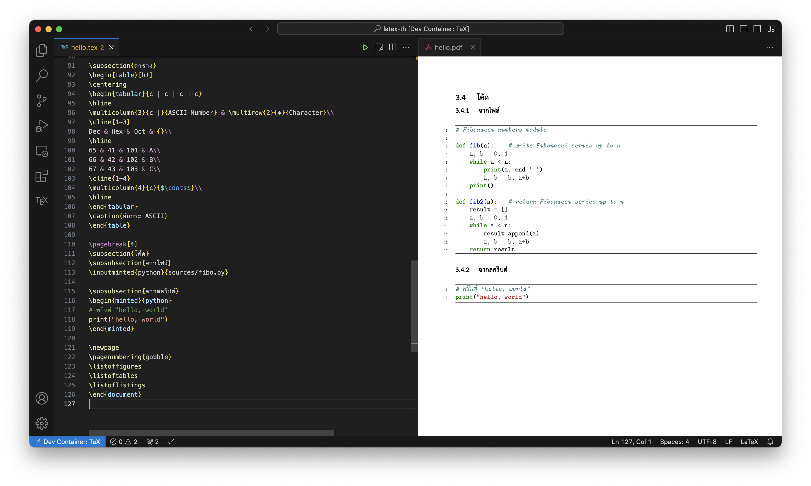

# $\rm{\LaTeX}$-th

> VS Code Dev Containers + Alpine image + $\rm{\TeX}$ Live (APK package)

$\rm{\LaTeX}$ Repository Template



## เริ่มต้น

### GitHub Codespaces
# $\rm{\LaTeX}$-th

> VS Code Dev Containers + Alpine image + $\rm{\TeX}$ Live (APK package)

$\rm{\LaTeX}$ Repository Template


## เริ่มต้น

### GitHub Codespaces

ใช้ template นี้บน cloud ด้วย GitHub Codespaces


1. สร้าง repository ใหม่โดยใช้ template นี้
1. ที่ repository ที่สร้างใหม่ กดปุ่ม **Code** เลือกแถบ **Codespaces** แล้วเลือก **Create codespace on main**

   

1. รอจน set up เสร็จแล้วเริ่มใช้งานได้เลย

   

### VS Code Dev Containers

ใช้ template นี้บนคอมพิวเตอร์ของคุณเองด้วย VS Code Dev Containers

1.  สร้าง repository ใหม่โดยใช้ template นี้
1.  เปิด repository ที่สร้างใหม่นี้ด้วย VS Code
1.  ติดตั้ง VS Code extension `ms-vscode-remote.remote-containers`

    > หากเปิดใช้งานคำสั่ง `code` ของ VS Code ไว้ สามารถใช้คำสั่ง:
    >
    >     $ code --install-extension ms-vscode-remote.remote-containers

1.  เรียก VS Code Command Palette (<kbd>Shift</kbd>+<kbd>Command</kbd>+<kbd>P</kbd> (Mac) / <kbd>Ctrl</kbd>+<kbd>Shift</kbd>+<kbd>P</kbd> (Windows/Linux))
    แล้วเลือกคำสั่ง **Remote-Containers: Reopen in Container**

    

1.  รอจน image ถูก build จนเสร็จ

## ทดสอบการติดตั้ง

1.  เปิดไฟล์ทดสอบ `_test/hello.tex`

    > หากเปิดใช้งานคำสั่ง `code` ของ VS Code ไว้ สามารถใช้คำสั่ง:
    >
    >     $ code _test/hello.tex

1.  Compile ไฟล์ทดสอบด้วยการกดปุ่ม run หรือเรียกคำสั่ง **LaTeX Workshop: Build LaTeX Project** ผ่าน VS Code Command Palette หรือด้วยคีย์ลัด (<kbd>Option</kbd>+<kbd>Command</kbd>+<kbd>B</kbd> (Mac) / <kbd>Ctrl</kbd>+<kbd>Alt</kbd>+<kbd>B</kbd> (Windows/Linux))
1.  หาก compile เสร็จสมบูรณ์ ควรจะได้ `_test/hello.pdf` ที่ไม่ว่างเปล่า (not blank)

## เมื่อต้องการหยุดใช้งาน

### GitHub Codespaces

เรียก VS Code Command Palette (<kbd>Shift</kbd>+<kbd>Command</kbd>+<kbd>P</kbd> (Mac) / <kbd>Ctrl</kbd>+<kbd>Shift</kbd>+<kbd>P</kbd> (Windows/Linux))
แล้วเลือกคำสั่ง **Codespaces: Stop Codespace**

### VS Code Dev Containers

- หากต้องการเปลี่ยนไปใช้งานนอก Dev Container ให้ให้เรียกคำสั่ง **Dev Containers: Reopen Folder Locally** ผ่าน VS Code Command Palette

  

- หากต้องการหยุดใช้งาน (ปิด project) ให้เรียกคำสั่ง **Remote: Close Remote Connection** ผ่าน VS Code Command Palette

## การ Compile และการตั้งค่า Build Steps

### การ Compile

โดยทั่วไป สามารถ compile ไฟล์ `.tex` ได้ผ่าน

- Command Line Interface (CLI)
- LaTeX-Workshop Magic Comments โดยเพิ่ม `% !TEX program = <program>` ใส่ในไฟล์ `.tex` สามารถดูข้อมูล Magic Comments ได้ที่ [_LaTeX-Workshop_](#latex-workshop) ด้านล่าง
- LaTeX-Workshop Recipe system (build steps)

### การตั้งค่า Build Steps

Template นี้อาศัย VS Code extension "LaTeX-Workshop" ในการจัดการขั้นตอนการ build

- Recipe system มีลำดับความสำคัญเหนือกว่า Magic Comments
- การสั่ง build สามารถทำได้หลายวิธี อย่างเช่น ด้วยการกดปุ่ม run หรือเรียกคำสั่ง **LaTeX Workshop: Build LaTeX Project** ผ่าน VS Code Command Palette หรือด้วยคีย์ลัด (<kbd>Shift</kbd>+<kbd>Command</kbd>+<kbd>B</kbd> (Mac) / <kbd>Ctrl</kbd>+<kbd>Alt</kbd>+<kbd>B</kbd> (Windows/Linux)) เป็นต้น
- สามารถตั้งค่าคำสั่งที่ต้องการให้ทำเมื่อ build ได้ที่ `<project root>/.vscode/settings.json`

  - คำสั่งอย่างเช่น `pdflatex`, `xelatex`, หรือ `bibtex` จะถูกกำหนดที่ `"latex-workshop.latex.tools": []` โดยแต่ละคำสั่งจะถูกเรียกว่า Tool
  - ขั้นตอนการ build จะถูกกำหนดที่ `"latex-workshop.latex.recipes": []` โดยขั้นตอนแต่ละแบบจะถูกเรียกว่า Recipe
  - หนึ่ง Recipe คือหนึ่ง sequence ที่จะต้องประกอบด้วย $\ge$ หนึ่ง Tool ถึงจะทำงานได้
  - ที่ `"latex-workshop.latex.recipes": []`, Recipe ที่อยู่ลำดับแรกสุดจะถูกเรียกเมื่อกดปุ่ม run หรือเรียกคำสั่ง **LaTeX Workshop: Build LaTeX Project** ผ่าน VS Code Command Palette หรือด้วยคีย์ลัด (<kbd>Shift</kbd>+<kbd>Command</kbd>+<kbd>B</kbd> (Mac) / <kbd>Ctrl</kbd>+<kbd>Alt</kbd>+<kbd>B</kbd> (Windows/Linux))
  - Tools และ Recipes ที่เตรียมไว้ให้เพิ่มเติมจากค่าเริ่มต้นมีดังนี้

    ```json
    {
      "latex-workshop.latex.tools": [
        {
          // ใช้สำหรับเรียกคำสั่ง xelatex ด้วย option -shell-escape
          "name": "xelatexsh",
          "command": "xelatex",
          "args": ["-shell-escape", "-pdf", "%DOC%"]
        }
      ],
      "latex-workshop.latex.recipes": [
        {
          "name": "xelatex ➞ bibtex ➞ xelatex × 2",
          "tools": ["xelatex", "bibtex", "xelatex", "xelatex"]
        },
        {
          "name": "xelatexsh × 3",
          "tools": ["xelatexsh", "xelatexsh", "xelatexsh"]
        },
        {
          "name": "xelatexsh ➞ bibtex ➞ xelatexsh × 2",
          "tools": ["xelatexsh", "bibtex", "xelatexsh", "xelatexsh"]
        }
      ]
    }
    ```

- สามารถ clean up ไฟล์ intermediate ต่าง ๆ ได้โดยเรียกคำสั่ง **LaTeX Workshop: Clean up auxiliary files** ผ่าน VS Code Command Palette หรือด้วยคีย์ลัด (<kbd>Option</kbd>+<kbd>Command</kbd>+<kbd>C</kbd> (Mac) / <kbd>Ctrl</kbd>+<kbd>Alt</kbd>+<kbd>C</kbd> (Windows/Linux))

## ข้อมูลเพิ่มเติม

### LaTeX-Workshop

#### Compiling Features [^1]

เราสามารถเลือก $\rm{\LaTeX}$ compiler ได้ผ่าน

- Recipe system (overrules Magic Comments)
- เพิ่ม Magic Comment (`% !TEX program = <program>`) ใส่ในไฟล์ `.tex`  
   โดยค่าเริ่มต้น เราจะไม่สามารถใช้ feature นี้ได้ เนื่องจาก extension นี้ถูกตั้งค่าให้ใช้ Recipe system เพื่อ backward compatibility เท่านั้น  
   แต่ถ้าเราต้องการใช้ Magic Comment ให้:

  ใน `<project root>/.vscode/settings.json` ตั้ง `"latex-workshop.latex.build.forceRecipeUsage": ""` เป็น `false`

[^1]: https://github.com/James-Yu/LaTeX-Workshop/wiki/Compile

ใช้ template นี้บน cloud ด้วย GitHub Codespaces


1. สร้าง repository ใหม่โดยใช้ template นี้
1. ที่ repository ที่สร้างใหม่ กดปุ่ม **Code** เลือกแถบ **Codespaces** แล้วเลือก **Create codespace on main**

   

1. รอจน set up เสร็จแล้วเริ่มใช้งานได้เลย

   

### VS Code Dev Containers

ใช้ template นี้บนคอมพิวเตอร์ของคุณเองด้วย VS Code Dev Containers

1.  สร้าง repository ใหม่โดยใช้ template นี้
1.  เปิด repository ที่สร้างใหม่นี้ด้วย VS Code
1.  ติดตั้ง VS Code extension `ms-vscode-remote.remote-containers`

    > หากเปิดใช้งานคำสั่ง `code` ของ VS Code ไว้ สามารถใช้คำสั่ง:
    >
    >     $ code --install-extension ms-vscode-remote.remote-containers

1.  เรียก VS Code Command Palette (<kbd>Shift</kbd>+<kbd>Command</kbd>+<kbd>P</kbd> (Mac) / <kbd>Ctrl</kbd>+<kbd>Shift</kbd>+<kbd>P</kbd> (Windows/Linux))
    แล้วเลือกคำสั่ง **Remote-Containers: Reopen in Container**

    

1.  รอจน image ถูก build จนเสร็จ

## ทดสอบการติดตั้ง

1.  เปิดไฟล์ทดสอบ `_test/hello.tex`

    > หากเปิดใช้งานคำสั่ง `code` ของ VS Code ไว้ สามารถใช้คำสั่ง:
    >
    >     $ code _test/hello.tex

1.  Compile ไฟล์ทดสอบด้วยการกดปุ่ม run หรือเรียกคำสั่ง **LaTeX Workshop: Build LaTeX Project** ผ่าน VS Code Command Palette หรือด้วยคีย์ลัด (<kbd>Option</kbd>+<kbd>Command</kbd>+<kbd>B</kbd> (Mac) / <kbd>Ctrl</kbd>+<kbd>Alt</kbd>+<kbd>B</kbd> (Windows/Linux))
1.  หาก compile เสร็จสมบูรณ์ ควรจะได้ `_test/hello.pdf` ที่ไม่ว่างเปล่า (not blank)

## เมื่อต้องการหยุดใช้งาน

### GitHub Codespaces

เรียก VS Code Command Palette (<kbd>Shift</kbd>+<kbd>Command</kbd>+<kbd>P</kbd> (Mac) / <kbd>Ctrl</kbd>+<kbd>Shift</kbd>+<kbd>P</kbd> (Windows/Linux))
แล้วเลือกคำสั่ง **Codespaces: Stop Codespace**

### VS Code Dev Containers

- หากต้องการเปลี่ยนไปใช้งานนอก Dev Container ให้ให้เรียกคำสั่ง **Dev Containers: Reopen Folder Locally** ผ่าน VS Code Command Palette

  

- หากต้องการหยุดใช้งาน (ปิด project) ให้เรียกคำสั่ง **Remote: Close Remote Connection** ผ่าน VS Code Command Palette

## การ Compile และการตั้งค่า Build Steps

### การ Compile

โดยทั่วไป สามารถ compile ไฟล์ `.tex` ได้ผ่าน

- Command Line Interface (CLI)
- LaTeX-Workshop Magic Comments โดยเพิ่ม `% !TEX program = <program>` ใส่ในไฟล์ `.tex` สามารถดูข้อมูล Magic Comments ได้ที่ [_LaTeX-Workshop_](#latex-workshop) ด้านล่าง
- LaTeX-Workshop Recipe system (build steps)

### การตั้งค่า Build Steps

Template นี้อาศัย VS Code extension "LaTeX-Workshop" ในการจัดการขั้นตอนการ build

- Recipe system มีลำดับความสำคัญเหนือกว่า Magic Comments
- การสั่ง build สามารถทำได้หลายวิธี อย่างเช่น ด้วยการกดปุ่ม run หรือเรียกคำสั่ง **LaTeX Workshop: Build LaTeX Project** ผ่าน VS Code Command Palette หรือด้วยคีย์ลัด (<kbd>Shift</kbd>+<kbd>Command</kbd>+<kbd>B</kbd> (Mac) / <kbd>Ctrl</kbd>+<kbd>Alt</kbd>+<kbd>B</kbd> (Windows/Linux)) เป็นต้น
- สามารถตั้งค่าคำสั่งที่ต้องการให้ทำเมื่อ build ได้ที่ `<project root>/.vscode/settings.json`

  - คำสั่งอย่างเช่น `pdflatex`, `xelatex`, หรือ `bibtex` จะถูกกำหนดที่ `"latex-workshop.latex.tools": []` โดยแต่ละคำสั่งจะถูกเรียกว่า Tool
  - ขั้นตอนการ build จะถูกกำหนดที่ `"latex-workshop.latex.recipes": []` โดยขั้นตอนแต่ละแบบจะถูกเรียกว่า Recipe
  - หนึ่ง Recipe คือหนึ่ง sequence ที่จะต้องประกอบด้วย $\ge$ หนึ่ง Tool ถึงจะทำงานได้
  - ที่ `"latex-workshop.latex.recipes": []`, Recipe ที่อยู่ลำดับแรกสุดจะถูกเรียกเมื่อกดปุ่ม run หรือเรียกคำสั่ง **LaTeX Workshop: Build LaTeX Project** ผ่าน VS Code Command Palette หรือด้วยคีย์ลัด (<kbd>Shift</kbd>+<kbd>Command</kbd>+<kbd>B</kbd> (Mac) / <kbd>Ctrl</kbd>+<kbd>Alt</kbd>+<kbd>B</kbd> (Windows/Linux))
  - Tools และ Recipes ที่เตรียมไว้ให้เพิ่มเติมจากค่าเริ่มต้นมีดังนี้

    ```json
    {
      "latex-workshop.latex.tools": [
        {
          // ใช้สำหรับเรียกคำสั่ง xelatex ด้วย option -shell-escape
          "name": "xelatexsh",
          "command": "xelatex",
          "args": ["-shell-escape", "-pdf", "%DOC%"]
        }
      ],
      "latex-workshop.latex.recipes": [
        {
          "name": "xelatex ➞ bibtex ➞ xelatex × 2",
          "tools": ["xelatex", "bibtex", "xelatex", "xelatex"]
        },
        {
          "name": "xelatexsh × 3",
          "tools": ["xelatexsh", "xelatexsh", "xelatexsh"]
        },
        {
          "name": "xelatexsh ➞ bibtex ➞ xelatexsh × 2",
          "tools": ["xelatexsh", "bibtex", "xelatexsh", "xelatexsh"]
        }
      ]
    }
    ```

- สามารถ clean up ไฟล์ intermediate ต่าง ๆ ได้โดยเรียกคำสั่ง **LaTeX Workshop: Clean up auxiliary files** ผ่าน VS Code Command Palette หรือด้วยคีย์ลัด (<kbd>Option</kbd>+<kbd>Command</kbd>+<kbd>C</kbd> (Mac) / <kbd>Ctrl</kbd>+<kbd>Alt</kbd>+<kbd>C</kbd> (Windows/Linux))

## ข้อมูลเพิ่มเติม

### LaTeX-Workshop

#### Compiling Features [^1]

เราสามารถเลือก $\rm{\LaTeX}$ compiler ได้ผ่าน

- Recipe system (overrules Magic Comments)
- เพิ่ม Magic Comment (`% !TEX program = <program>`) ใส่ในไฟล์ `.tex`  
   โดยค่าเริ่มต้น เราจะไม่สามารถใช้ feature นี้ได้ เนื่องจาก extension นี้ถูกตั้งค่าให้ใช้ Recipe system เพื่อ backward compatibility เท่านั้น  
   แต่ถ้าเราต้องการใช้ Magic Comment ให้:

  ใน `<project root>/.vscode/settings.json` ตั้ง `"latex-workshop.latex.build.forceRecipeUsage": ""` เป็น `false`

[^1]: https://github.com/James-Yu/LaTeX-Workshop/wiki/Compile
